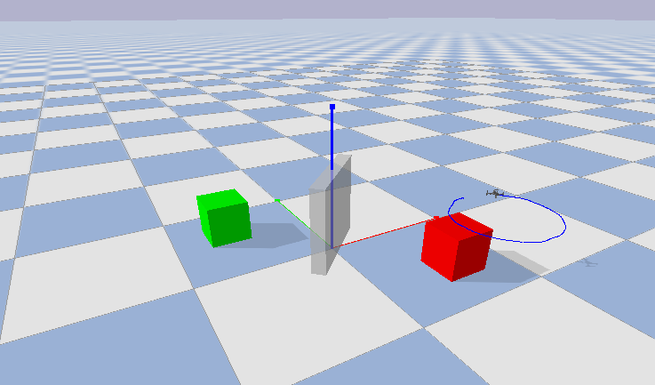

# rrt-mpc-quad
Repository for PDM project 

This is going to be one KILLER project.

## Setup
```
git clone git@github.com:nikhil-sethi/rrt-mpc-quad.git
cd rrt-mpc-quad
chmod +x ./tooling/install.sh
./tooling/install.sh
```

## Run
```
python main.py --map 1
```
If everything worked correctly, you should see the drone follow a circular trajectory like the following image

 

## API
### Obstacles

A small sketch explaining how to create a new obstacle
```python
from obstacles import Cube
from utils import Color

name = "new_cube" # this will be the name of the generated urdf
origin = [1,2,3] # list of x, y, z coordinates (meters)
orientation = [0,0,1.57] # list of roll, pitch and yaw angles: a positive(CCW) 90 deg yaw
side = [0.4, 0.4, 0.4] # side lengths of the cube. Have to be equal. for a cuboid, import a cuboid 
color = Color.GLASS # a gray tranluscent color

cube = Cube(name="new_cube", origin = [1,3,4], orientation = orientation, color = color)
```

You can use the cube object in the planning implementation for collision checking. The URDF file is now automatically genereated and we don't need to worry about interfacing with pybullet and python.