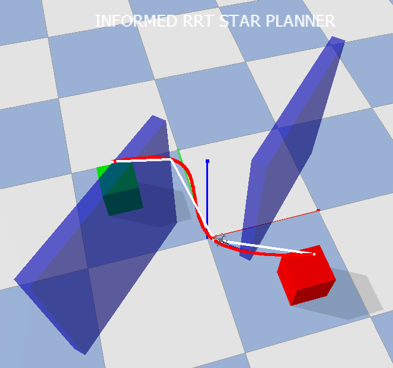
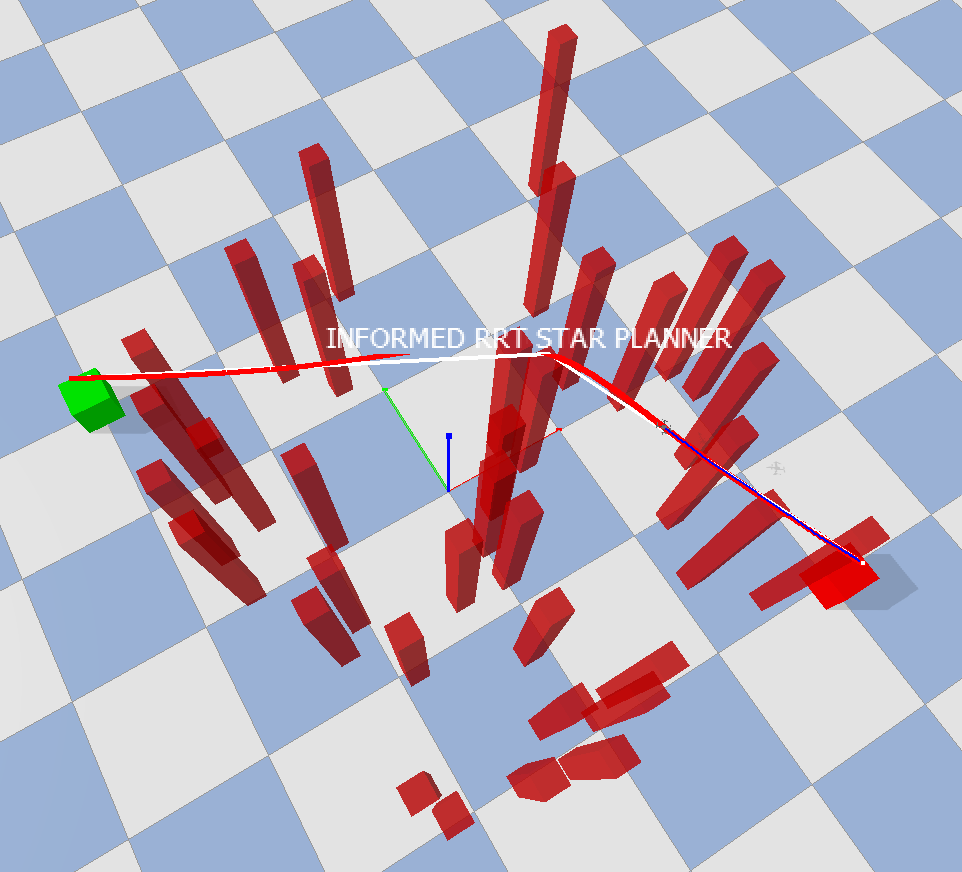

# rrt-mpc-quad
Repository for PDM project - Group 11

## Welcome!
This repository contains a working simulation package for drones in a 3D environment based on gym-pybullet-drones implementing global planning algorithms including RRT, RRT*, and several variations. The instructions below will help you install the package and get the simulation running and adjusted for your needs.

## Setup
```
git clone git@github.com:nikhil-sethi/rrt-mpc-quad.git
cd rrt-mpc-quad
chmod +x ./tooling/install.sh
./tooling/install.sh
```

## Run Commands (all to be run while in repository folder)
Basic Run - This will be the most basic run option, showing a single planner in a single map with the GUI on.
```
python3 main.py [<options>] 
```
Visual Demo - This will show all planners in a sequence each once on our hardest map, Map 3.
```
python3 visual_demo.py
```

Evaluation - This will run a sequence of GUI-off (by default) performance evaluations, on all maps, for all planners, for a specified number of trials on each map. Then results are outputted to the terminal and to a results/results.txt file.
```
python3 results/evaluation.py 
```
In total, 5 different planner variants can be chosen:
| Planner | Argument | Description |
| ------- | -------- | -------- |
| RRT | `rrt` | New nodes added to graph based on closest collision free path to existing graph nodes. |
| Informed RRT | `inf_rrt` | Builds on RRT and adds workspace constriction to ensure new nodes are within a region where only shorter paths than the known path would be found. Also includes a known-path obstacle-routing-specific optimizing algorithm we call Path Hunter. |
| RRT with recycling | `rec_rrt` | Builds on RRT and adds deletion on nodes not on the known path time time a new path is found. |
| RRT* | `rrt_star` | As opposed to RRT, new nodes are added based on the lowest cost-to-come fromt he starting position. Additionally, garbage collection removes nodes that cannot be a part of the fastest path. Lastly, rerouting of existing nodes through newly sampled nodes for a shorter cost-to-come is implemented. |
| Informed RRT* | `inf_rrt_star` | Builds on RRT* by adding the workspace constriction and Path Hunter algorithm. Rerouting is disabled by default. |

Also, seven maps have been implemented (numbered 0 to 6) with images at the end of the README.

For example, running informed RRT* on map 2: 
```
python3 main.py --planner='inf_rrt_star' --map_number=2
```

Reference the following table for all run options (ordered by relevancy):


| Option argument | Argument Type | Default | Explanation |
| --------------- | ------------- | ------- | ---------- |
| `--planner` | see table above | `rrt_star` | Which planner to use
| `--map_number` | 0-6 | 1 | Which map to use 
| `--min_snap` | True/False | True | Trajectory optimization flag
| `--corridor` | True/False | False | Equality corridor for trajectory optimization
| `--plot` | True/False | False | Plots control graphs at the end
| `--plot_all` | True/False | False | To plot all nodes and lines
| `--seed` | int | None | Seed value for reproducibility
| `--duration_sec` | int | 60 | Duration of the simulation 
| `--output_folder` | str | `results/logs/` | Folder for logs
| `--record_video` | True/False | False | Whether to record a video 
| `--gui` | True/False | True | Whether to use PyBullet GUI 
| `--simulation_freq_hz` | int | 240 | Simulation frequency in Hz 
| `--control_freq_hz` | int | 48 | Control frequency in Hz 

## Class Diagram (Note that Path Hunter is also included in the Informed Methods)
 

## Maps
### Map 0
 

### Map 1
 

### Map 2
 

### Map 3
 

### Map 4
 

### Map 5
 

### Map 6
 

## MPC (under development)

There is also a development branch called `feat/mpc`. This branch consists of an initial setup to working with mpc as a local planner in combination with one of the sampling based global planners. To see how everything is structured and a bit about the process, you can check out `MPC.md` in that branch.

## Video Demonstrations
### Map 3 Demo
<video src="https://user-images.githubusercontent.com/119050107/212774590-f3ea7a13-ea81-40dd-8e58-eb21fe6d7bc5.mov"></video>
