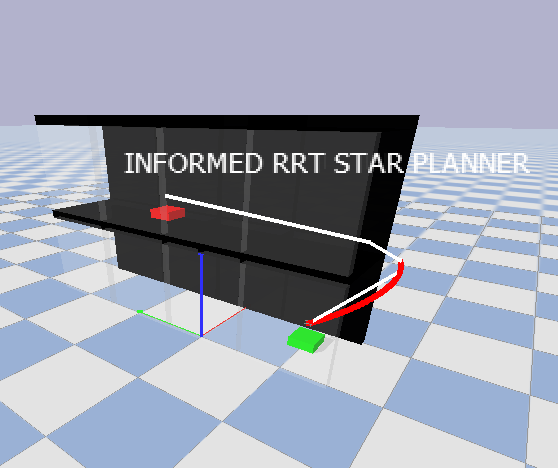

# rrt-mpc-quad
Repository for PDM project - Group 11

## Setup
```
git clone git@github.com:nikhil-sethi/rrt-mpc-quad.git
cd rrt-mpc-quad
chmod +x ./tooling/install.sh
./tooling/install.sh
```

## Run
General run command (while in repository folder):
```
python3 main.py [<options>]
```
This runs the planner and the simulation. Six maps have been implemented (numbered 0 to 5) and 5 different planner variants can be chosen:
| Planner | Argument |
| ------- | -------- |
| RRT | `rrt` |
| Informed RRT | `inf_rrt` |
| RRT with recycling | `rec_rrt` |
| RRT* | `rrt_star` |
| Informerd RRT* | `inf_rrt_star` |

For example, running informed RRT* on map 2: 
```
python3 main.py --planner='inf_rrt_star' --map_number=2
```

Reference the following table for all run options (ordered by relevancy):


| Option argument | Argument Type | Default | Explanation |
| --------------- | ------------- | ------- | ---------- |
| `--planner` | see table above | `rrt_star` | Which planner to use
| `--map_number` | 0-5 | 1 | Which map to use 
| `--min_snap` | True/False | True | Trajectory optimization flag
| `--corridor` | True/False | False | Equality corridor for trajectory optimization
| `--plot` | True/False | False | Plots control graphs at the end
| `--plot_all` | True/False | False | To plot all nodes and lines
| `--seed` | int | None | Seed value for reproducibility
| `--duration_sec` | int | 60 | Duration of the simulation 
| `--output_folder` | str | `results/logs/` | Folder for logs
| `--record_video` | True/False | False | Whether to record a video 
| `--gui` | True/False | True | Whether to use PyBullet GUI 
| `--simulation_freq_hz` | int | 240 | Simulation frequency in Hz 
| `--control_freq_hz` | int | 48 | Control frequency in Hz 

## Class Diagram
 

## Maps
### Map 0
 

### Map 1
 

### Map 2
 

### Map 3
 

### Map 4
 

### Map 5
 

## API
### Obstacles

A small sketch explaining how to create a new obstacle
```python
from obstacles import Cube
from utils import Color

name = "new_cube" # this will be the name of the generated urdf
origin = [1,2,3] # list of x, y, z coordinates (meters)
orientation = [0,0,1.57] # list of roll, pitch and yaw angles: a positive(CCW) 90 deg yaw
side = [0.4, 0.4, 0.4] # side lengths of the cube. Have to be equal. for a cuboid, import a cuboid 
color = Color.GLASS # a gray tranluscent color

cube = Cube(name = name, origin = origin, orientation = orientation, color = color)
```

You can use the cube object in the planning implementation for collision checking. The URDF file is now automatically genereated and we don't need to worry about interfacing with pybullet and python.